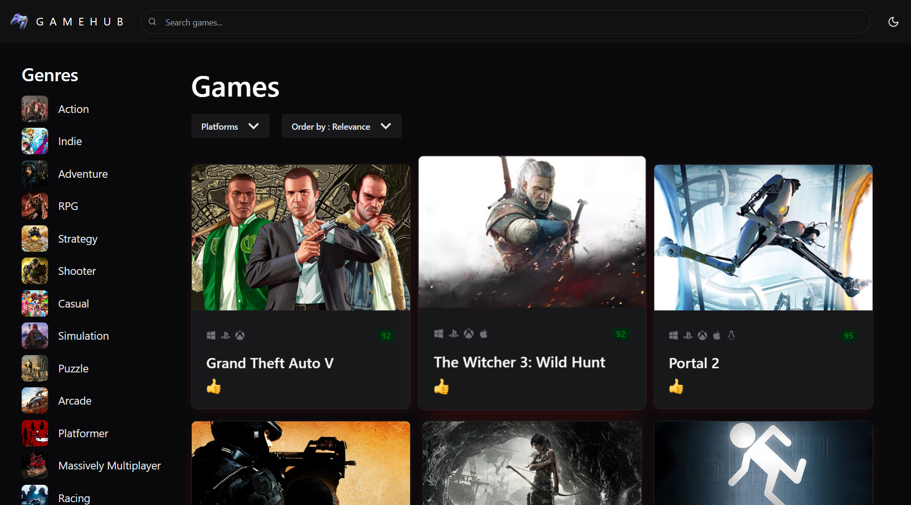
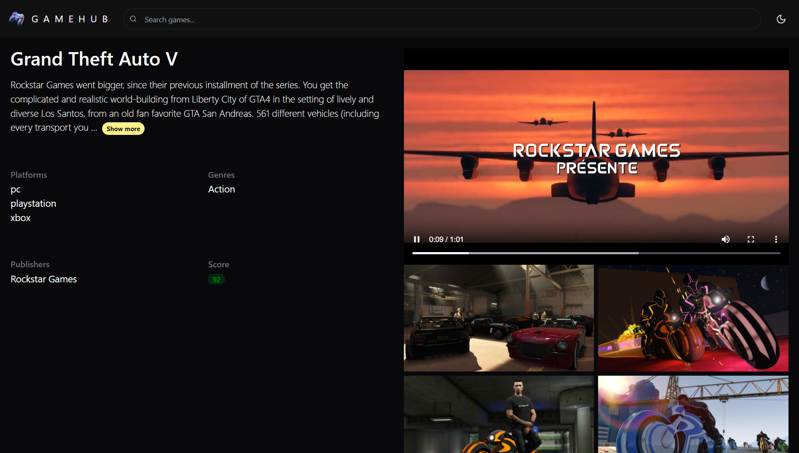
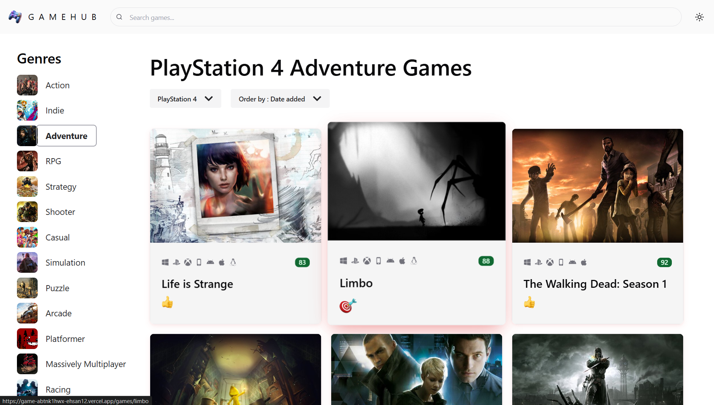
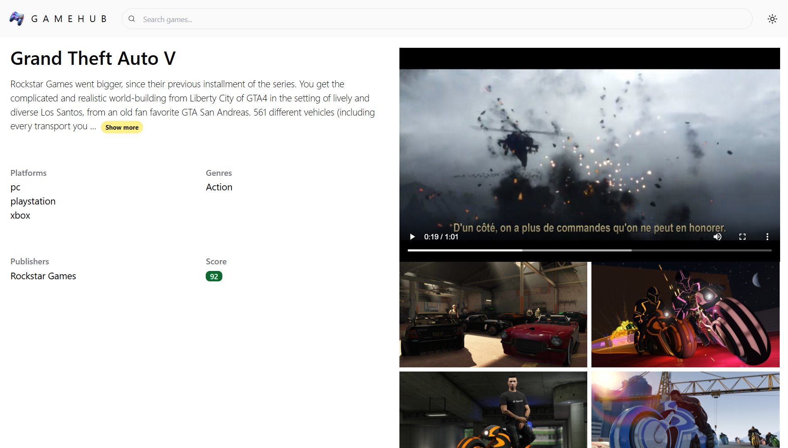

# 🎮 Game Explorer — RAWG API Client

A full-featured game discovery web app built with React and TypeScript, powered by the [RAWG Video Games Database API](https://rawg.io/apidocs). Built as a hands-on project while transitioning from backend development into modern frontend engineering.

**[🔗 Live Demo](https://game-abtnk1hwx-ehsan12.vercel.app/)** · **[📂 Source Code](https://github.com/ehsanghaderian/game-hub)**


---

## About This Project

I'm a backend developer (.NET Core, 4+ years) currently expanding into frontend development. This project was built to apply React and TypeScript concepts to a real, API-driven application rather than isolated tutorials — covering state management, data fetching/caching, routing, and responsive UI design.

## Features

- 🔍 **Search & Filter** — search games by name, filter by genre and platform
- ↕️ **Sorting** — multiple sort options (rating, release date, popularity, etc.)
- ♾️ **Infinite Scroll Pagination** — games load automatically as you scroll
- 🎮 **Game Detail Pages** — trailer, screenshots, and full description for each title
- 📱 **Fully Responsive** — optimized layout for mobile, tablet, and desktop
- 🧭 **Client-side Routing** — smooth navigation between game list and detail views

## Tech Stack

| Category     | Technology                   |
| ------------ | ---------------------------- |
| Framework    | React + TypeScript           |
| Build Tool   | Vite                         |
| UI Library   | Chakra UI                    |
| Server State | TanStack Query (React Query) |
| Client State | Zustand                      |
| Routing      | React Router                 |
| Data Source  | RAWG API                     |
| Deployment   | Vercel                       |

## Why These Choices

- **TanStack Query** handles all server-state (fetching, caching, pagination) so the UI stays in sync with the API without manual loading/error state management.
- **Zustand** manages lightweight global state (active filters, search query) without the boilerplate of larger state management solutions.
- **Chakra UI** enabled fast, accessible, responsive styling with a consistent design system.

## Screenshots






## Running Locally

```bash
git clone https://github.com/your-username/your-repo.git
cd your-repo
npm install
npm run dev
```

Create a `.env` file with your RAWG API key:

```
VITE_RAWG_API_KEY=your_api_key_here
```

## What's Next

Currently building a second project — a full-stack SaaS application with a .NET Core backend — to bring backend and frontend skills together in one cohesive product.

---

**Connect with me:** [LinkedIn](https://www.linkedin.com/in/ehsan-ghaderian-24b83222b/) | Open to remote opportunities and freelance projects.
